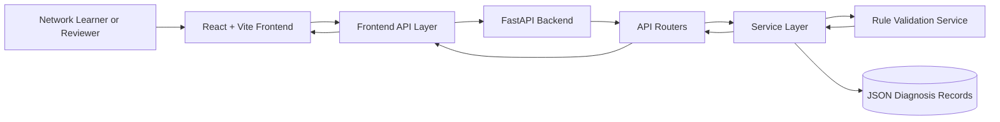
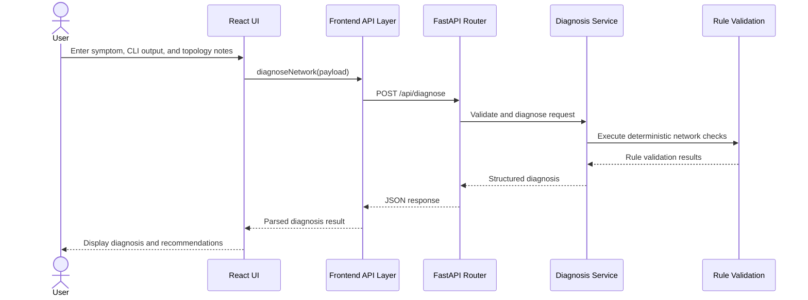
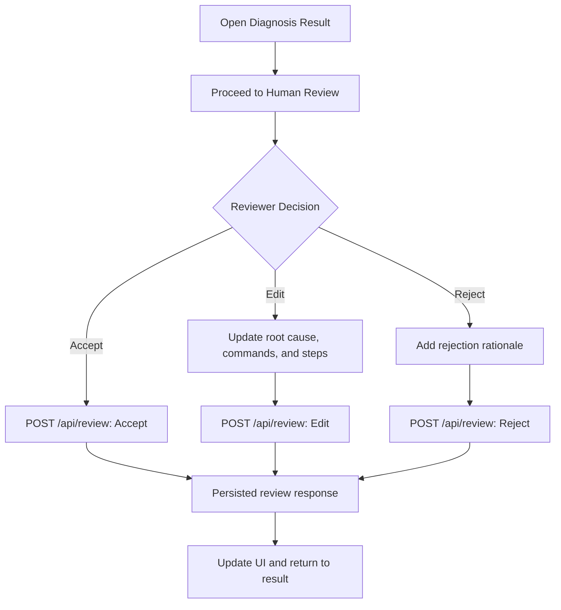

# NetSage AI Architecture

This document describes the architecture of NetSage AI, an AI-powered Cisco Packet Tracer troubleshooting assistant. The design separates the React user experience, frontend API integration, FastAPI transport layer, deterministic troubleshooting services, and persisted diagnostic records.

## 1. High-level System Architecture

NetSage AI uses a browser-based React application and a Python FastAPI backend. The frontend owns presentation and user interaction; the backend owns diagnosis processing, analytics, history retrieval, and human-review updates.



## 2. Frontend Architecture (React + Vite)

The frontend is a Vite-powered React single-page application. React Router selects the active page while a shared layout provides consistent navigation and presentation.

- **Pages** provide the diagnosis, result, dashboard, history, and human review experiences.
- **Components** provide reusable visual modules such as the confidence gauge, OSI layer visualizer, and diagnosis timeline.
- **API layer** centralizes backend URL configuration, request construction, JSON parsing, and error handling.
- **State hooks** manage loading, failure, form, filter, and returned API data state within each page.

The UI sends structured payloads only through the API layer, enabling future additions such as authentication headers, refresh tokens, telemetry, and request interceptors without changing page-level request code.

## 3. Backend Architecture (FastAPI)

The backend exposes a modular FastAPI application with routers grouped by business capability:

| Router | Responsibility |
| --- | --- |
| `diagnose_router` | Accepts network symptoms and Cisco CLI output, then returns a diagnosis. |
| `dashboard_router` | Returns aggregate metrics and distributions for the dashboard. |
| `history_router` | Returns searchable and filterable diagnosis history. |
| `human_review_router` | Applies Accept, Edit, and Reject reviewer decisions. |

Routers validate transport-level input and delegate work to services. Services isolate business logic, including diagnosis generation, rule validation, history queries, analytics calculations, and persisted-review updates. Pydantic schemas define API request and response contracts.

## 4. Data Flow

The standard troubleshooting path follows this sequence:

> User → React UI → API Layer → FastAPI Router → Service Layer → Rule Validation → Response → UI



## 5. Component Interaction

The major page and component interactions are:

| Page | Main interaction | Reusable components |
| --- | --- | --- |
| Diagnose | Submits symptoms and CLI output for analysis | Loading experience |
| AI Result | Displays returned diagnosis and remediation plan | `DiagnosisTimeline`, `ConfidenceGauge`, `OSILayerVisualizer` |
| Dashboard | Displays aggregate system metrics and distributions | Dashboard cards and distribution widgets |
| History | Queries and renders filterable audit records | Existing table and export controls |
| Human Review | Accepts, edits, or rejects a diagnosis | `DiagnosisTimeline` |

The result page and review page communicate through the diagnosis identifier in the route. This keeps navigation lightweight and makes every result independently addressable.

## 6. Folder Structure

```text
.
├── backend/
│   ├── app/
│   │   ├── data/          # Persisted diagnosis JSON records
│   │   ├── routers/       # FastAPI routes by domain
│   │   ├── schemas/       # Pydantic request/response contracts
│   │   ├── services/      # Diagnosis, history, analytics, and review logic
│   │   └── main.py        # Application factory and middleware configuration
│   └── requirements.txt
├── src/
│   ├── components/        # Confidence, timeline, and OSI visual components
│   ├── layouts/           # Shared application layout
│   ├── pages/             # Route-level React pages
│   └── services/          # Centralized frontend HTTP API layer
├── ARCHITECTURE.md
└── README.md
```

## 7. API Flow

All frontend requests target a single configured backend base URL. The API layer uses asynchronous requests, returns parsed JSON, and throws centralized errors for non-success responses.

| User action | Frontend function | HTTP request | Backend capability |
| --- | --- | --- | --- |
| Analyze symptoms | `diagnoseNetwork(data)` | `POST /api/diagnose` | Diagnosis and rule validation |
| Open dashboard | `getDashboard()` | `GET /api/dashboard` | Metrics and distributions |
| Search/filter history | `getHistory(filters)` | `GET /api/history` | History query |
| Save review | `submitHumanReview(data)` | `POST /api/review` | Human review update |

## 8. Human Review Workflow

Human review provides an explicit verification layer for AI recommendations. A reviewer can accept the recommendation, correct it in edit mode, or reject it with a rationale. The backend persists the decision and returns the updated review state to the page.



## 9. Dashboard Analytics Flow

The dashboard aggregates persisted diagnosis records into operational metrics.

1. The dashboard page requests `GET /api/dashboard` when it loads.
2. The dashboard router delegates the request to `DashboardService`.
3. The service loads diagnosis records and calculates totals, review counts, confidence, accuracy, common faults, and distributions.
4. The API returns dashboard-ready JSON.
5. Existing cards and distribution widgets render the returned values.

This keeps aggregation logic on the backend, avoiding duplication of analytical rules across client pages.

## 10. Future Scalability

The current modular boundaries support a practical path to production scale:

- Replace JSON persistence with PostgreSQL or another managed database.
- Add authentication and role-based authorization at the frontend API layer and FastAPI dependency layer.
- Run FastAPI behind a reverse proxy with multiple application workers.
- Add a queue for longer-running AI or topology-analysis jobs and expose job-status endpoints.
- Cache dashboard aggregates and paginate history results for large record sets.
- Add observability through structured logging, metrics, tracing, and error reporting.
- Add automated test suites, contract tests, CI/CD, and containerized deployment.
- Separate deterministic validation from optional LLM analysis while preserving evidence and reviewer auditability.
